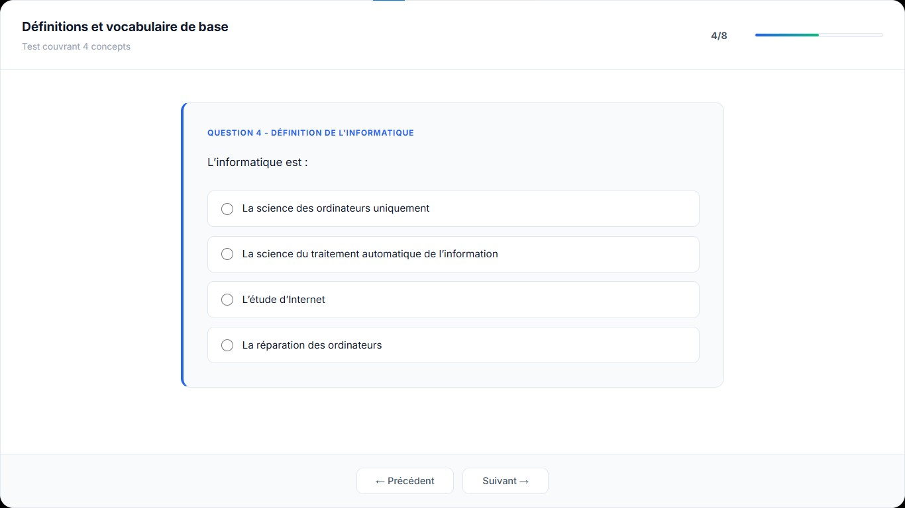
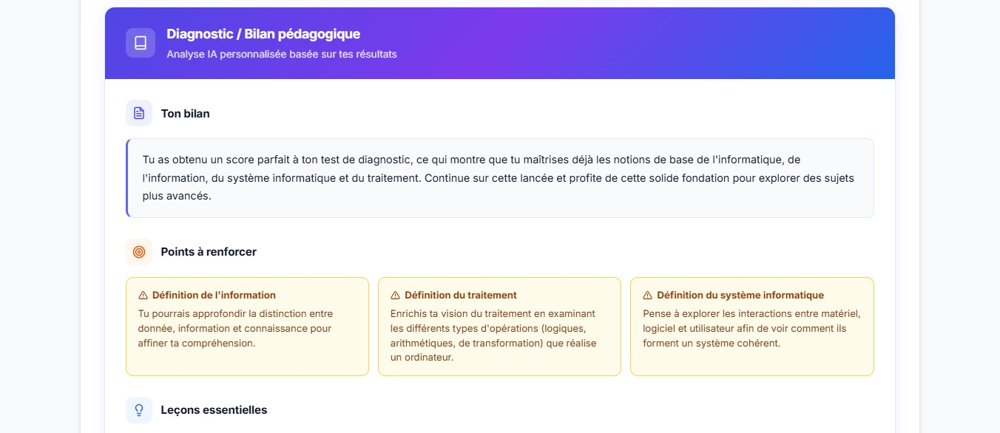
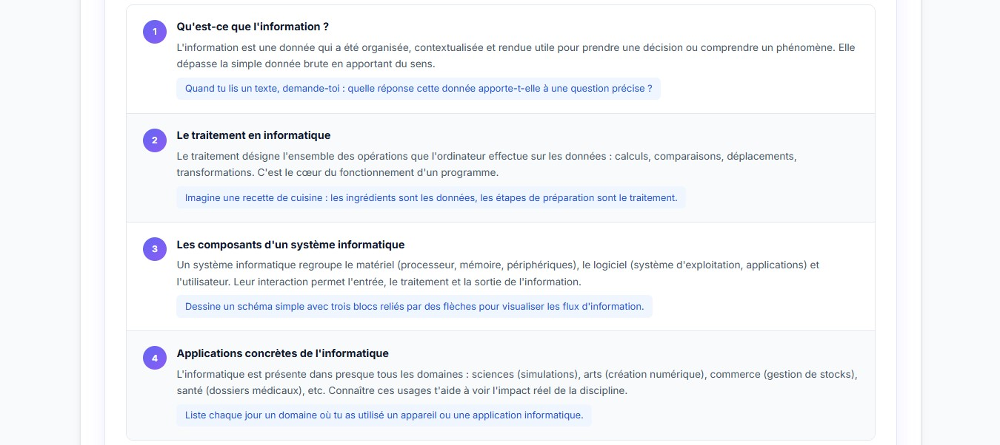
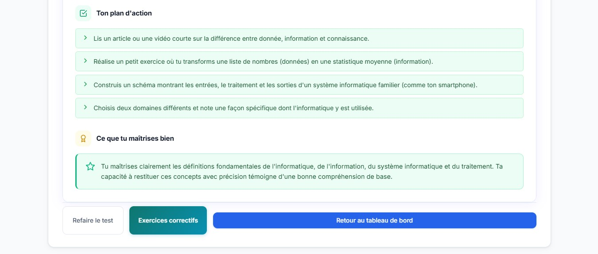
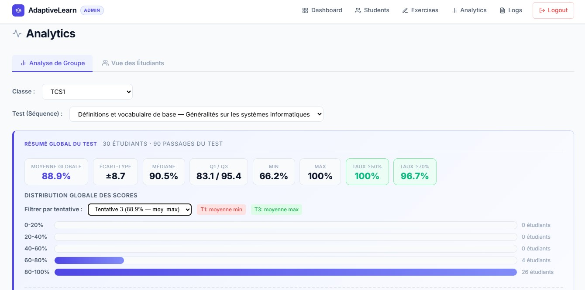
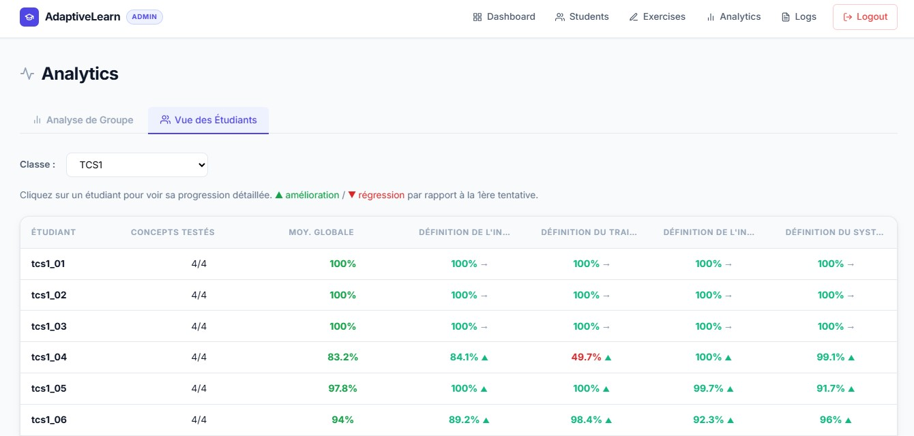

<div align="center">

<!-- Optional: replace with your own banner -> docs/banner.jpg -->


# AdaptiveLearn

### AI-Powered Adaptive Learning System for Computer Science Education

*Turning every student's mistake into a personalized learning opportunity.*

<p align="center">
  
  
  
  
  
  
</p>

<p align="center">
  
  
  
  
</p>

</div>

---

## Overview

**AdaptiveLearn** is a full-stack web platform that brings **personalized, AI-driven learning** to computer science education in the Moroccan qualifying secondary school (*Tronc Commun Sciences — TCS*).

It was born from a real classroom problem observed during teaching practice: in classes of **30–35 students** with widely heterogeneous levels, teachers cannot provide individual feedback or differentiated remediation to everyone. AdaptiveLearn solves this by letting each student **self-assess**, receive an **AI-generated personalized report**, and practice **corrective exercises targeted at their own mistakes** — anonymously, without fear of judgment.

The platform is grounded in two pedagogical principles:

- **Pedagogy of Error** *(Astolfi, 1997)* — the error is treated as a learning tool, not a fault to punish.
- **Differentiated Instruction** — content, pace, and feedback adapt to each learner's needs.

> **Field result:** in the pilot class (TCS1, 30 students), average mastery rose by **+22.8 percentage points** (66.1% → 88.9%) across three diagnostic attempts.

---

## Table of Contents

- [Key Features](#key-features)
- [Screenshots](#screenshots)
- [Tech Stack](#tech-stack)
- [Architecture](#architecture)
- [AI Engine](#ai-engine)
- [Getting Started](#getting-started)
- [User Roles](#user-roles)
- [Project Structure](#project-structure)
- [Results & Validation](#results--validation)
- [Roadmap](#roadmap)
- [Author](#author)
- [License](#license)

---

## Key Features

| Feature | Description |
|---|---|
| **AI Personalized Reports** | After each diagnostic test, an LLM generates a structured report: strengths, gaps by concept, key lessons, and a 3–5 step action plan. |
| **Targeted Corrective Exercises** | The AI auto-generates MCQs based on the exact questions a student got wrong. |
| **Answer Explanations** | Students can request a clear explanation for any incorrect answer. |
| **Mastery Tracking** | A mastery level (0–1) is computed and stored per student, per concept, updated after every attempt. |
| **6 Question Types** | MCQ, True/False, Short Answer, Reordering, Matching, and Long Answer (keyword-based scoring). |
| **Gamification** | Badges unlocked at ≥ 90% mastery and downloadable PDF certificates per sequence. |
| **Full TCS Curriculum** | 4 modules, 12 pedagogical sequences, and 40+ concepts aligned with the official program. |
| **Bilingual Interface** | Built-in internationalization (French / English). |
| **Secure Auth & Roles** | Bearer-token authentication with RBAC (`student` / `admin`) and bcrypt password hashing. |
| **Teacher Analytics** | Dashboards with stats by class, sequence, and attempt; per-student progress and an audit log. |

---

## Screenshots

> To add your images: create a `docs/screenshots/` folder in the repo and drop the images with the names below. They'll appear automatically.

<div align="center">

**Authentication**


<br/><br/>

**Student Dashboard** — progress by module and sequence, badges, and AI recommendations


<br/><br/>

**Diagnostic Test** — multi-type questions with a progress bar and instant feedback



<br/><br/>

**AI Pedagogical Report** — personalized post-test analysis with corrective exercises





<br/><br/>

**Admin Analytics Dashboard** — per-class, per-sequence, and per-attempt statistics




</div>

---

## Tech Stack

<div align="center">


</div>

<div align="center">

| Layer | Technologies |
|---|---|
| **Backend** | Python · FastAPI · Uvicorn (ASGI) |
| **Database** | SQLite (13 tables) |
| **Validation** | Pydantic v2 |
| **Security** | Bearer Token Auth · bcrypt · RBAC |
| **Frontend** | HTML5 · CSS3 · Vanilla JavaScript (SPA) · i18n (fr/en) |
| **AI / LLM** | OpenRouter — Nemotron-120B · GPT-OSS-20B · Gemma-4-31B |
| **Tooling** | Git · GitHub · Visual Studio Code |

</div>

---

## Architecture

AdaptiveLearn follows a classic **three-tier architecture**:

<div align="center">


</div>

---

## AI Engine

The AI engine powers three features through the **OpenRouter** unified API, with an automatic **model-cascade fallback** that guarantees continuity when a free model hits a rate limit (`HTTP 429`):

```
nvidia/nemotron-120b:free
        └─▶ openai/gpt-oss-20b:free
                └─▶ google/gemma-4-31b-it:free
                        └─▶ openrouter/auto
```

| Endpoint | Purpose |
|---|---|
| `POST /ai/explain` | Explains why a given answer is correct. |
| `POST /ai/learning-guide` | Generates the personalized pedagogical report. |
| `POST /ai/corrective-exercises` | Builds targeted MCQs from the student's mistakes. |

---

## Getting Started

### Prerequisites


- Python 3.10+
- An [OpenRouter](https://openrouter.ai) API key (free tier works)

### Installation

```bash
# 1. Clone the repository
git clone https://github.com/Tahainfo/AdaptiveLearn-AI-Based-Adaptive-Learning-System-for-Computer-Science---v3.git
cd AdaptiveLearn-AI-Based-Adaptive-Learning-System-for-Computer-Science---v3

# 2. (Recommended) create a virtual environment
python -m venv venv
# Windows:
venv\Scripts\activate
# macOS / Linux:
source venv/bin/activate

# 3. Install dependencies
pip install -r requirements.txt
```

### Environment variables

Create a `.env` file in the project root:

```env
OPENROUTER_API_KEY=your_openrouter_api_key_here
```

> **Never commit your `.env`** — make sure it's listed in `.gitignore`.

### Run the app

```bash
uvicorn main:app --reload
```

Then open **http://127.0.0.1:8000** in your browser.

> Adjust `main:app` and `requirements.txt` to match your actual entry-point file and dependencies if they differ.

---

## User Roles

<div align="center">

| Student | Teacher (Admin) |
|---|---|
| Register / log in | Manage student accounts |
| Take diagnostic tests | Create & edit diagnostic exercises |
| Read the AI report | View class & per-student analytics |
| Practice corrective exercises | Track mastery by concept and attempt |
| Track progress & earn badges | Consult the audit log |

</div>

---

## Project Structure

```
AdaptiveLearn/
├── backend/            # FastAPI app, routes, AI services, auth
├── frontend/           # SPA — HTML / CSS / JavaScript, i18n
├── database/           # SQLite schema & seed data
├── docs/               # Screenshots, banner, documentation
├── .env                # API keys (not committed)
├── requirements.txt
└── README.md
```
> Adapt this tree to your real folder names.

---

## Results & Validation

The system was validated on the **TCS1** pilot class (**30 students**, 3 attempts per concept):

<div align="center">

| Class | Students | Attempt 1 | Attempt 2 | Attempt 3 | Gain |
|:---:|:---:|:---:|:---:|:---:|:---:|
| **TCS1** | 30 | 66.1% | 80.7% | 88.9% | **+22.8 pts** |

</div>

This progression validates the core learning loop:

```
Diagnose  →  Adaptive Exercises  →  Re-assess
```

---

## Roadmap

- [ ] Cloud deployment for live classroom use
- [ ] Pilot testing in a real classroom with data collection
- [ ] Mobile version (PWA)
- [ ] Extension to other subjects (Math, Physics-Chemistry, Life Sciences)
- [ ] Deep Knowledge Tracing (LSTM-based mastery modeling)
- [ ] Computerized Adaptive Testing (Item Response Theory)
- [ ] Parent progress dashboard
- [ ] LMS integration (Moodle / Google Classroom via SCORM / xAPI)
- [ ] Migration from SQLite to PostgreSQL for production

---

## Author

**ISMAILI Taha**
Personal Supervised Project (PPE) — CRMEF Casablanca-Settat
Supervised by **Mme. BAZI Kaoutar**
2025 / 2026

---

## License

This project is licensed under the **MIT License** — see the [LICENSE](LICENSE) file for details.

---

## Acknowledgments

- **CRMEF Casablanca-Settat** for the training and pedagogical guidance.
- The teachers and students of the qualifying high schools who took part in the field observations.
- Pedagogical foundations: *Astolfi (1997)*, *Bloom (1984)*, *Black & Wiliam (1998)*, *Vygotsky (1978)*, *Bruner (1966)*.

<div align="center">

---

**If you find this project useful, consider giving it a star.**

</div>
